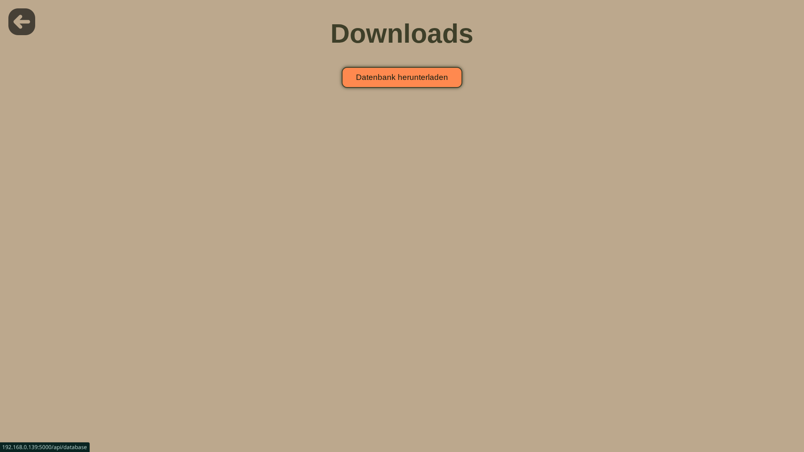
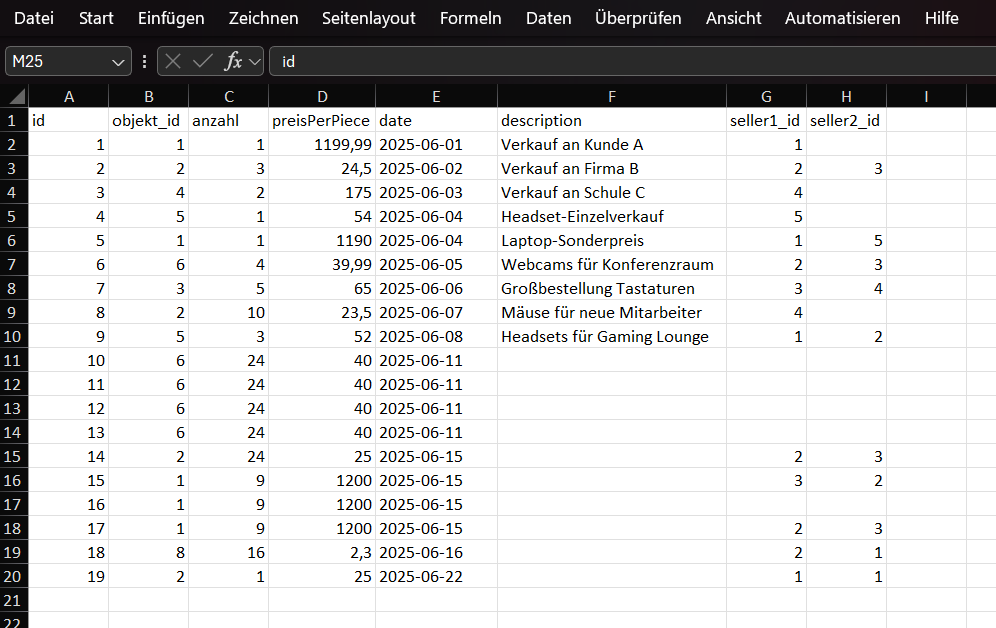
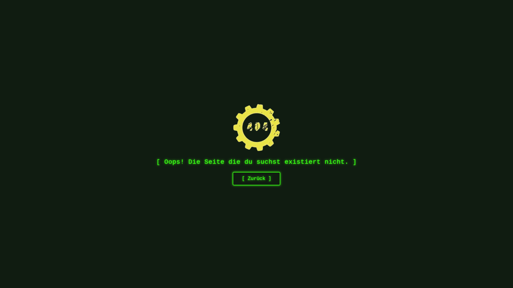

# 📦 Schüler-Firma Lagerverwaltung

Verwalte Verkäufe, Verkäufer und Inventar einfach und sicher über den Browser.

---

## 🚀 Schnellstart

### 1. Initialisierung (empfohlen)

Führe das Setup-Skript aus, um alles automatisch einzurichten:

```powershell
python init.py
```

Das Skript erstellt eine virtuelle Umgebung, installiert Abhängigkeiten und legt die Konfigurationsdatei an.

---

### 2. Manuelle Einrichtung (optional)

#### a) Virtuelle Umgebung erstellen

```powershell
python -m venv venv
```

#### b) Umgebung aktivieren (Windows PowerShell)

```powershell
.\venv\Scripts\Activate.ps1
```

> Bei Problemen mit der Ausführung:
>
> ```powershell
> Set-ExecutionPolicy -ExecutionPolicy RemoteSigned -Scope CurrentUser
> ```
>
> Dann erneut aktivieren.

#### c) Abhängigkeiten installieren

```powershell
pip install -r requirements.txt
```

**Benötigte Pakete:**

- `flask` – Webserver
- `gunicorn` – Produktionsserver

#### d) Konfiguration

Die Datei `config/settings.json` wird automatisch durch `init.py` erstellt.  
Du kannst sie nach deinen Bedürfnissen anpassen.

---

### 3. Anwendung starten

```powershell
python run.py
```

Die Web-App ist dann erreichbar unter:

```
http://localhost:5000
```

---

## 🔐 Admin-Zugang

- Das **Admin-Panel** ist über die Web-Oberfläche erreichbar.
- Zugang erfolgt über das Passwort aus der Konfiguration (`admin_password` in `config/settings.json`).

---

## ✅ Funktionen

- Inventar, Verkäufe und Verkäufer einsehen und bearbeiten
- Produkte suchen
- Geschützter Admin-Bereich
- Einstellungen direkt im Browser bearbeiten

---

## 🛠️ Projektstruktur

```
Schueler-Firma/
│
├── app/
│   ├── __init__.py
│   ├── db.py
│   ├── routes.py
│   ├── settings.py
│   ├── static/
│   └── templates/
│
├── config/
│   └── settings.json
│
├── venv/
├── requirements.txt
├── run.py
├── init.py
└── README.md
```

---

## 📷 Screenshots

<div style="display: flex; flex-wrap: wrap; gap: 12px; justify-content: center;">






</div>
