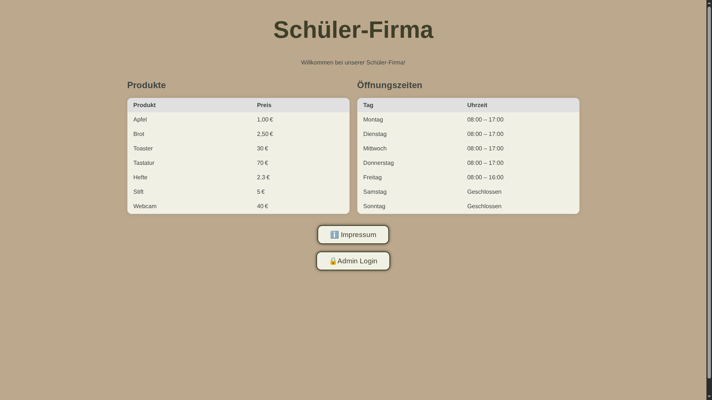
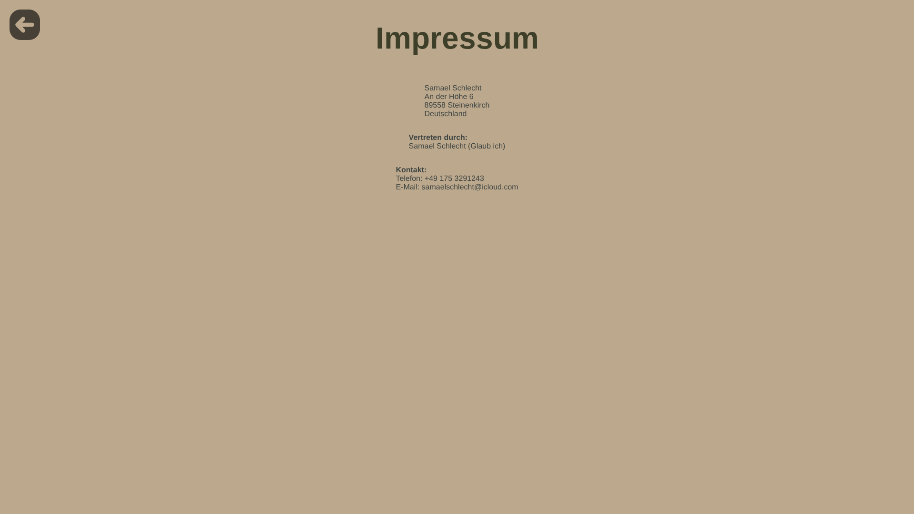
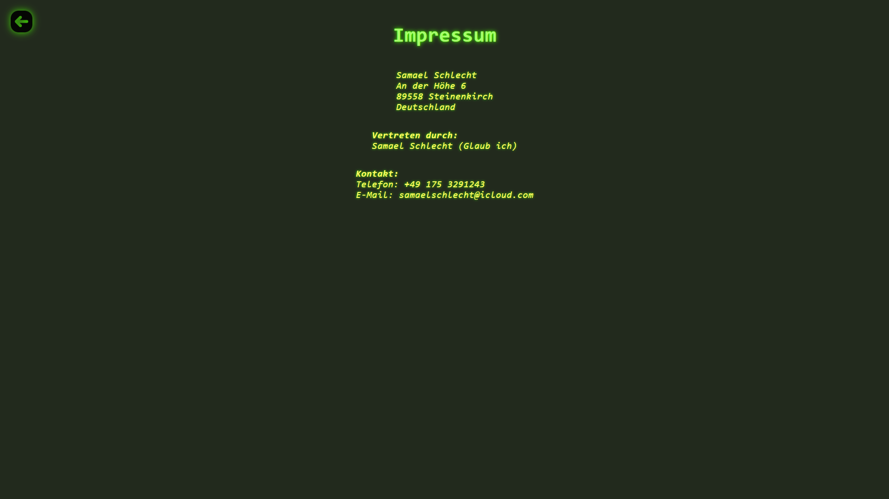
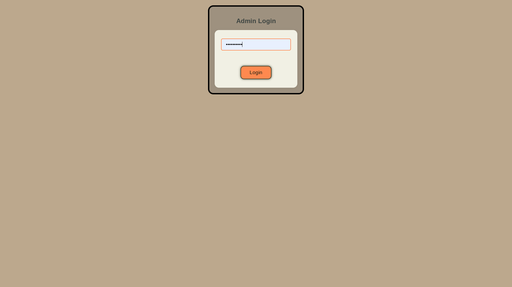
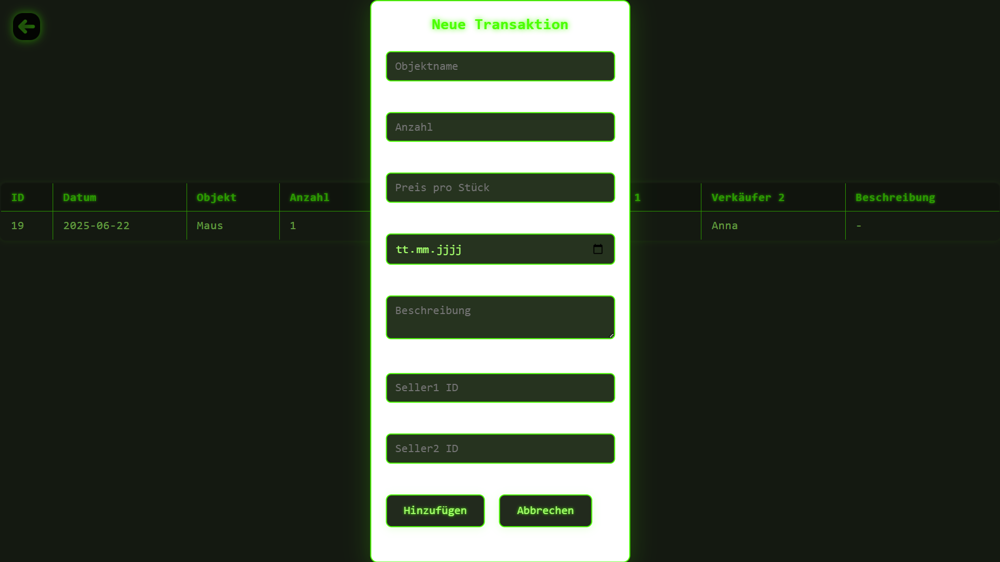
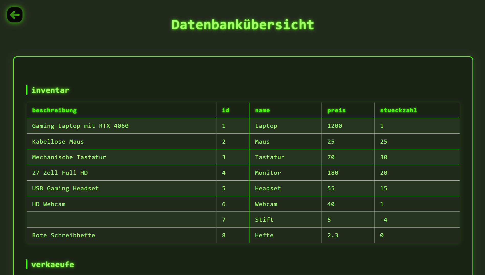
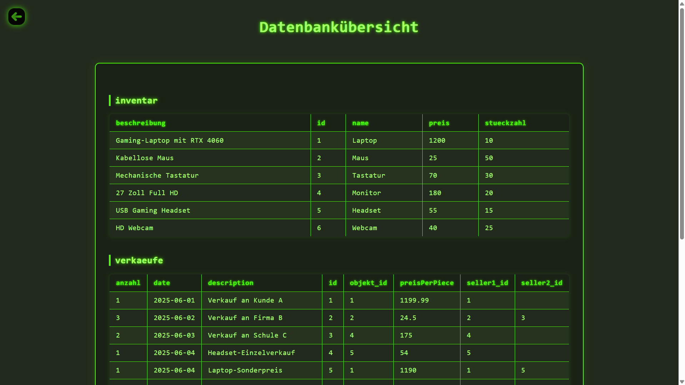
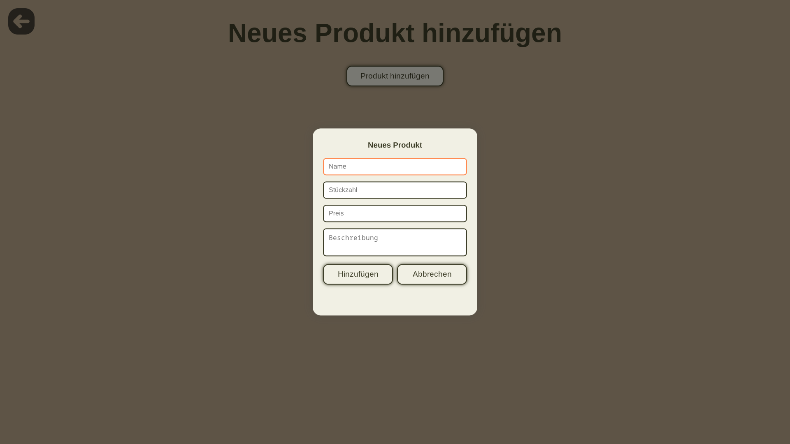
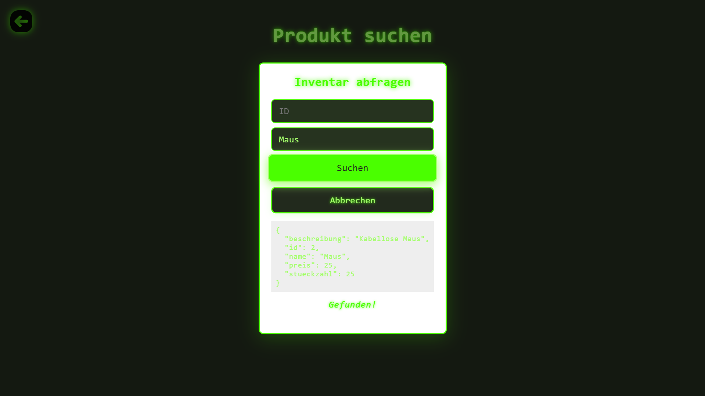
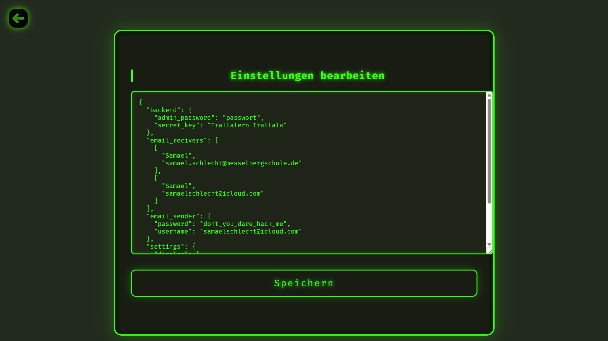

# 📦 Web-App zur Lagersverwaltung

Verwalte Verkäufe, Verkäufer und Inventar einfach über den Browser. Ideal für Schülerfirmen, kleine Betriebe oder private Projekte.

---

## 🚀 Schnellstart

### 1. Virtuelle Umgebung erstellen

```powershell
python -m venv venv
```

### 2. Umgebung aktivieren (Windows PowerShell)

```powershell
.\venv\Scripts\Activate.ps1
```

❗ Bei Problemen mit der Ausführung:

```powershell
Set-ExecutionPolicy -ExecutionPolicy RemoteSigned -Scope CurrentUser
```

Dann erneut aktivieren:

```powershell
.\venv\Scripts\Activate.ps1
```

### 3. Abhängigkeiten installieren

```powershell
pip install -r requirements.txt
```

**Benötigte Pakete:**
- `flask` – Webserver
- `python-dotenv` – Laden von Umgebungsvariablen aus `.env`

---

### 4. `.env`-Datei erstellen

Erstelle im Hauptverzeichnis eine Datei namens `.env` mit folgendem Inhalt:

```env
EMAIL_USER=dein.email@example.com     # Optional
EMAIL_PASS=deinEmailPasswort          # Optional
SECRET_KEY=ein_sicherer_schlüssel     # Pflicht
ADMIN_PASS=adminPasswort              # Pflicht (für Admin-Login)
```

---

### 5. Anwendung starten

```powershell
python main.py
```

Ein lokaler **Flask-Server** wird gestartet. Die Web-App ist dann erreichbar unter:

```
http://localhost:5000
```

---

## 🔐 Admin-Zugang

- Das **Admin-Panel** ist über die Web-Oberfläche erreichbar.
- Den Knopf **Admin werden doppelt drücken**
- Zugang erfolgt über das Passwort in der `.env`-Datei (`ADMIN_PASS`).

---

## ✅ Funktionen

- Inventar, Verkaufe, Verkaufer einsehen und teilweise bearbeiten
- Produkte suchen
- Teilweise geschützter admin Bereich

## 📷Screenshots

<div style="display: flex; flex-wrap: wrap; gap: 12px; justify-content: center;">













</div>
