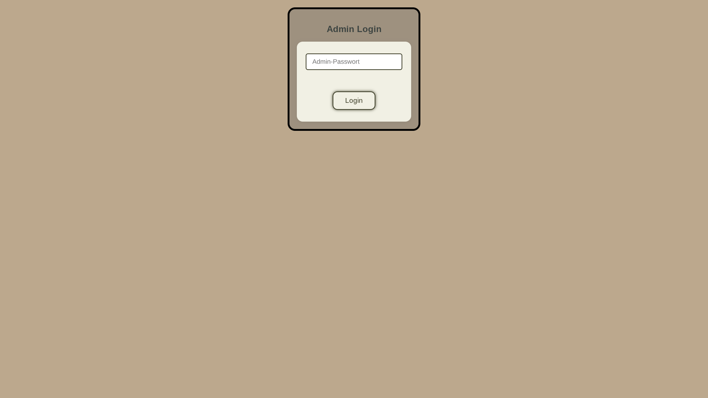
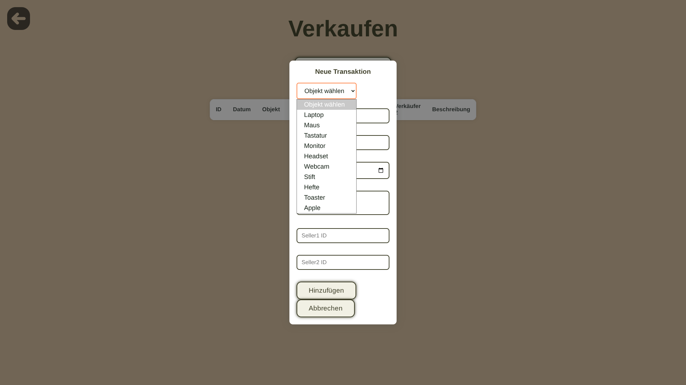

# 📦 Web-App zur Lagersverwaltung

Verwalte Verkäufe, Verkäufer und Inventar einfach über den Browser.

---

## 🚀 Schnellstart

### 1. Virtuelle Umgebung erstellen

```powershell
python -m venv venv
```

### 2. Umgebung aktivieren (Windows PowerShell)

```powershell
.\venv\Scripts\Activate.ps1
```

❗ Bei Problemen mit der Ausführung:

```powershell
Set-ExecutionPolicy -ExecutionPolicy RemoteSigned -Scope CurrentUser
```

Dann erneut aktivieren:

```powershell
.\venv\Scripts\Activate.ps1
```

### 3. Abhängigkeiten installieren

```powershell
pip install -r requirements.txt
```

**Benötigte Pakete:**
- `flask` – Webserver
- `gunicorn` – Produktions WSGL 

---

### 4. `settings.json`-Datei erstellen

Erstelle im Hauptverzeichnis eine Datei namens `.env` mit folgendem Inhalt:

```json
{
  "email_recivers": [ //Alle Empfänger der Email [NAME, EMAIL]
    ["Max", "max.mustermann@lol.de"],
    ["Erika", "erika.blume@heide.de"]
  ],
  "email_sender": {//Acount der für die versendung zuständing ist
    "username": "EMAIL",
    "password": "PASSWORT"
  },
  "backend": {//Wichige funktionen für das Backend
    "secret_key": "b9f4e2a1c7d8f6e3b2a9c5d7e8f1a2b3",//Verschlüsselungs key
    "admin_password": "admin123"//Passwort für das Admin Passwort
  }
}
```

---

### 5. Anwendung starten

```powershell
python main.py
```

Ein lokaler **Flask-Server** wird gestartet. Die Web-App ist dann erreichbar unter:

```
http://localhost:5000
```

---

## 🔐 Admin-Zugang

- Das **Admin-Panel** ist über die Web-Oberfläche erreichbar.
- Den Knopf **Admin login** doppelt drücken.
- Zugang erfolgt über das Passwort in den Einstellungen (`ADMIN_PASS`).

---

## ✅ Funktionen

- Inventar, Verkaufe, Verkaufer einsehen und teilweise bearbeiten
- Produkte suchen
- Teilweise geschützter Admin Bereich

## 📷Screenshots

<div style="display: flex; flex-wrap: wrap; gap: 12px; justify-content: center;">








</div>
